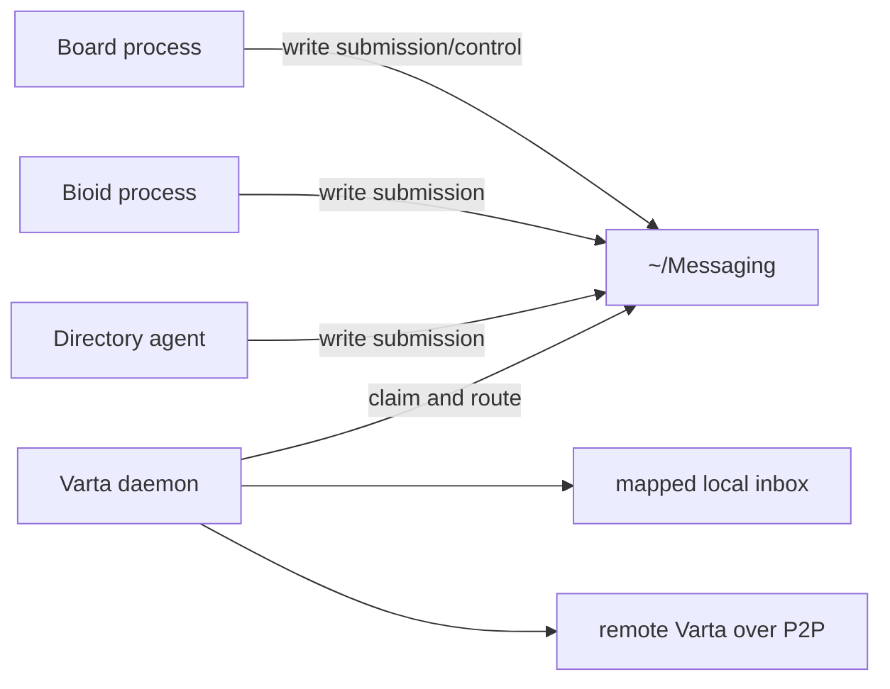
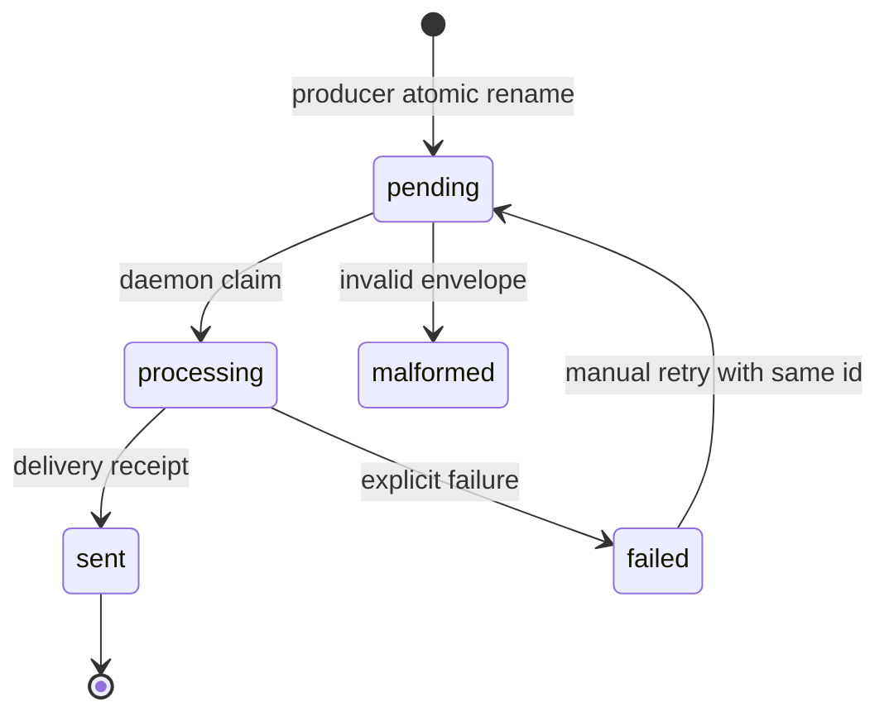
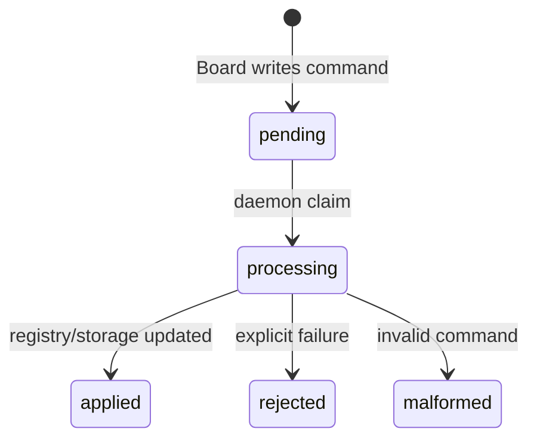

# Varta Operations Contract

This document defines process-level operation for the filesystem
submission contract described in `SPEC.md`.

## Process Model

Board, Bioid, and directory agents do not call each other directly.
They also do not need separate local and remote send paths. Their stable
operation is to place an envelope submission in the managed outbox.

## Roles

| Role | Responsibility | Must Not |
|---|---|---|
| Producer | Create an envelope and place it in `outbox/pending`. | Write directly to a remote path. |
| Board P0 control | Write lifecycle commands to `control/pending`. | Mutate in-flight daemon state directly. |
| Varta daemon | Claim submissions/control commands, route local/remote, write durable state. | Interpret task semantics or mutate payload data. |
| Consumer | Read its mapped `inbox/`, process envelopes, ack completed messages. | Delete unprocessed envelopes. |
| Remote service | Accept P2P delivery requests and store them under authorized roots. | Allow arbitrary filesystem writes. |
| Human observer | Inspect outbox, inbox, registry, logs, and timeline through Finder or app UI. | Treat delivery receipt as task completion. |

## Startup Contract

On startup the daemon must:

1. create `outbox`, `control`, `registry`, and `mailboxes`,
2. resume pending submissions and control commands,
3. leave previously failed or rejected items visible,
4. start remote transport when configured,
5. expose health for human inspection.

## Submission Lifecycle

`sent/` contains the original `envelope.json` plus `receipt.json`.
`failed/` contains the original `envelope.json` plus `failure.json`.
`quarantine/malformed/outbox/` contains submissions that could not be decoded.
Failed or malformed submissions must not terminate the daemon loop after durable
state has been written.

## Control Lifecycle

| Command | Applied by daemon |
|---|---|
| `registerMailbox` | Canonicalize `Address.path`, create storage, write registry. |
| `unregisterMailbox` | Remove registry and optionally storage. |
| `runGarbageCollection` | Apply retention to processed/sent/failed, audit, control, and quarantine state. |

Rejected or malformed control commands must be visible as durable records and
must not stop later control commands from being applied.

## Local And Remote Routing

| `Envelope.to.host` | Daemon action |
|---|---|
| `local` | Map `to.path` into `~/Messaging/mailboxes/local/.../inbox/<id>.json`. |
| `peer:<id>` | Resolve the peer and send a remote delivery request. |
| `device:<name>` | Resolve to a peer or fail explicitly. |
| unknown | Move to `failed/`. |

Remote delivery is a daemon-to-daemon API. It is not the producer API.

## Consumer Loop

Consumers should:

1. read their mapped `inbox/` snapshot,
2. process in deterministic order,
3. make processing idempotent by envelope id,
4. write reply submissions before acking when a reply is required,
5. move successfully processed envelopes to mapped `processed/`.

## Observability

Varta.app should be a human inspection and intervention tool:

| View | Source |
|---|---|
| Pending messages | `outbox/pending` |
| In-flight messages | `outbox/processing` |
| Delivered messages | `outbox/sent` and mapped recipient inbox |
| Failed messages | `outbox/failed` and `failure.json` |
| Quarantined items | `quarantine/malformed`, `quarantine/orphaned`, and `quarantine/unauthorized` |
| Mailbox registry | `registry/mailboxes` |
| P0 control history | `control/applied` and `control/rejected` |
| Conversation timeline | Envelope ids, causality, metadata, and receipt state |

Finder remains valid because the filesystem is the contract.
