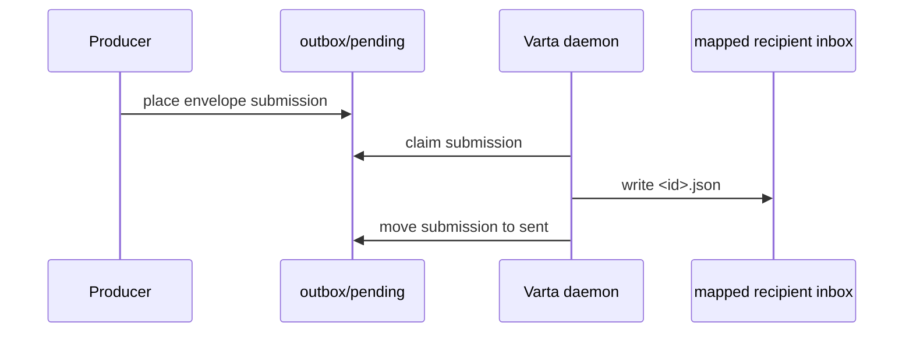
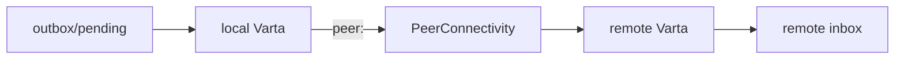

# Varta Specification

Varta is a filesystem-backed submission and mailbox contract
for independent agent processes.

The central rule is:

> Producers submit envelopes into the Varta-managed filesystem
> outbox. The Varta daemon decides whether delivery is local or
> remote.

This keeps local and remote sends uniform for producers while still
allowing daemon-to-daemon P2P transport for remote machines.

## Goals

- Use the filesystem as the canonical inter-process API.
- Keep producers, consumers, management tools, and Varta as independent
  processes.
- Preserve a human-inspectable message trail.
- Route local and remote recipients through the same submission shape.
- Surface failures explicitly through durable outbox state and typed
  errors.

## Non-Goals

- Varta is not a workflow engine.
- Varta is not a chat UI.
- Varta is not responsible for interpreting payload semantics.
- Varta does not prove that a task completed; it only proves
  that an envelope was durably delivered or rejected.

## Address

`Address` is the routing contract.

```swift
public struct Address: Sendable, Codable, Hashable {
    public let host: String
    public let path: String
}
```

| Host form | Meaning |
|---|---|
| `local` | `path` is on the current local filesystem. |
| `peer:<peer-id>` | `path` is interpreted by a remote P2P peer. |
| `device:<stable-name>` | A local alias that can resolve to a peer. |

For non-local hosts, the sender must not mount or write the remote
path. The remote Varta service validates the path against its
own policy before storage.

## Envelope

`Envelope` is the durable wire format.

```swift
public struct Envelope: Sendable, Codable, Hashable, Identifiable {
    public let id: UUID
    public let from: Address
    public let to: Address
    public let issuedAt: Date
    public let causality: [UUID]
    public let mediaType: String
    public let data: Data
    public let metadata: [String: String]
}
```

| Field | Contract |
|---|---|
| `id` | Globally unique envelope id created before submission. |
| `from` | Sender mailbox address for replies and provenance. |
| `to` | Recipient mailbox address used by the daemon router. |
| `issuedAt` | Sender-side creation time, encoded as ISO-8601 JSON. |
| `causality` | Envelope ids that directly caused this envelope. |
| `mediaType` | Open media type string for interpreting `data`. |
| `data` | Opaque payload bytes, encoded as Base64 in JSON. |
| `metadata` | String-only extension map. Stable keys should be namespaced. |

Reserved metadata prefixes:

| Prefix | Owner |
|---|---|
| `messaging.` | Varta transport and mailbox metadata |
| `agent.` | Agent runtime metadata |
| `app.` | Application-specific metadata |

Replies should include the request id in both `causality` and
`metadata["messaging.inReplyTo"]`.

## Filesystem Submission API

Every Varta daemon owns a service root:

```text
~/Messaging/
  outbox/
    pending/
      <envelope-id>/
        envelope.json
    processing/
    sent/
    failed/
  quarantine/
    malformed/
      outbox/
```

Producer operation:

1. create an `Envelope`,
2. stage `<envelope-id>/envelope.json`,
3. atomically move the staged directory into `outbox/pending/`.

The implementation-provided `FilesystemSubmissionQueue.submit(_:)`
performs this write, but it is only a helper for the filesystem
contract. The contract is the directory shape.

Daemon operation:

1. list `outbox/pending/`,
2. decode `envelope.json`,
3. move the submission to `outbox/processing/`,
4. route by `envelope.to.host`,
5. move the submission to `outbox/sent/` with `receipt.json`, or
   `outbox/failed/` with `failure.json`,
6. continue processing later submissions after durable malformed or failed
   records are written.

The daemon must not silently delete malformed or failed submissions.

## Recipient Mailbox

Recipient mailbox layout:

```text
~/Messaging/
  mailboxes/
    local/
      Users/
        <user>/
          .../
            <address.path components>/
              inbox/
                <envelope-id>.json
              processed/
                <envelope-id>.json
              rejected/
              failed/
```

`address.path` points to the owner directory. It is not the storage
directory. Varta maps it into the service root:

```text
/Users/example/Agents/planner
  -> ~/Messaging/mailboxes/local/Users/example/Agents/planner
```

Remote peers use a namespace under `mailboxes/peers/<peer-id>/`.

## Registry

Mailbox creation is an explicit lifecycle operation. A mailbox is valid
only when it has a registry entry:

```text
~/Messaging/
  registry/
    mailboxes/
      local/
        ...
          registration.json
```

Delivery must not create arbitrary mailbox roots without registration.

## Control Plane

Management tools request mailbox lifecycle operations through control commands:

```text
~/Messaging/
  control/
    pending/
      <command-id>/
        command.json
    processing/
    applied/
    rejected/
  quarantine/
    malformed/
      control/
```

| Kind | Contract |
|---|---|
| `registerMailbox` | Canonicalize `Address.path`, create mailbox storage, write registry. |
| `unregisterMailbox` | Remove registry and optionally delete storage. |
| `runGarbageCollection` | Apply retention to processed, sent, failed, audit, control history, and quarantine state. |

Required behavior:

- keep mailbox state out of agent working directories,
- create recipient mailbox directories through registration/control operations,
- write inbox files atomically,
- reject duplicate envelope ids,
- return received envelopes sorted by `issuedAt`,
- move acked envelopes from `inbox/` to `processed/`,
- move malformed submissions and commands to quarantine,
- reject failed control commands durably without terminating the daemon loop,
- surface decoding and path errors explicitly.

## Local Delivery

Local delivery is a daemon routing result, not a different producer
operation.



## Remote P2P Delivery

Remote delivery uses the same local outbox submission, then switches
transport inside the daemon.



The sender daemon sends a `RemoteEnvelopeDeliveryRequest` to the remote
Varta service. The remote service validates and stores the
envelope on its own filesystem.

Protocol id:

```text
/varta/envelope/1
```

```swift
public struct RemoteEnvelopeDeliveryRequest: Sendable, Codable, Hashable {
    public let envelope: Envelope
    public let requestedAt: Date
}

public struct RemoteEnvelopeDeliveryResponse: Sendable, Codable, Hashable {
    public let envelopeID: UUID
    public let accepted: Bool
    public let storedAt: Date?
    public let error: RemoteEnvelopeDeliveryError?
}
```

## Acknowledgements

There are two separate acknowledgements.

| Ack | Writer | Meaning |
|---|---|---|
| Delivery receipt | Varta daemon | Envelope was durably stored in the recipient mailbox or remote peer accepted it. |
| Message ack | Consumer | The recipient processed the envelope and moved it to mapped `processed/`. |

Producers must not treat delivery receipt as task completion.
